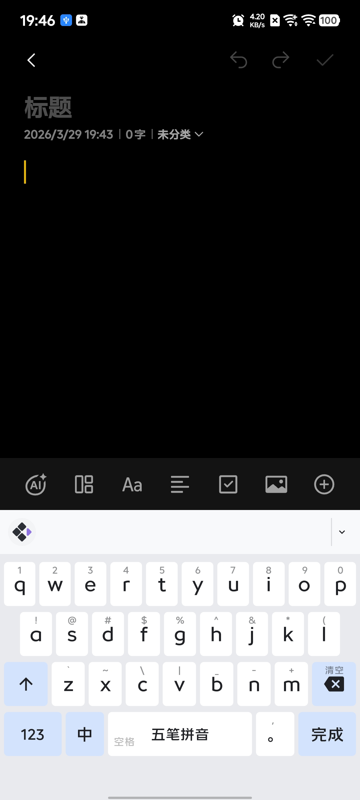
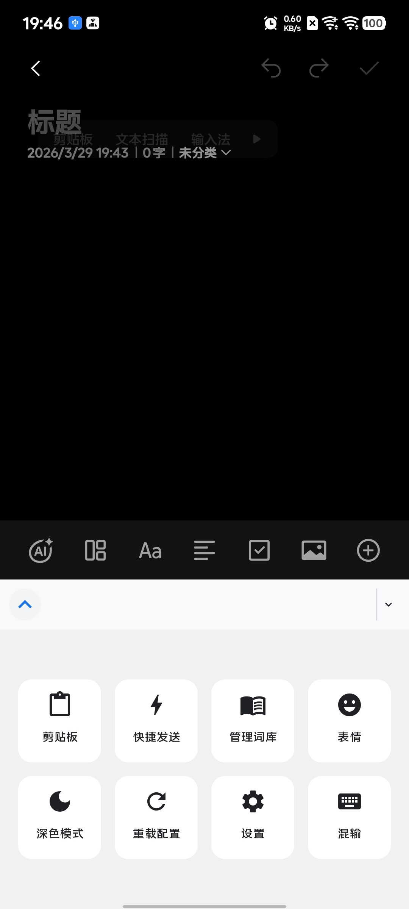
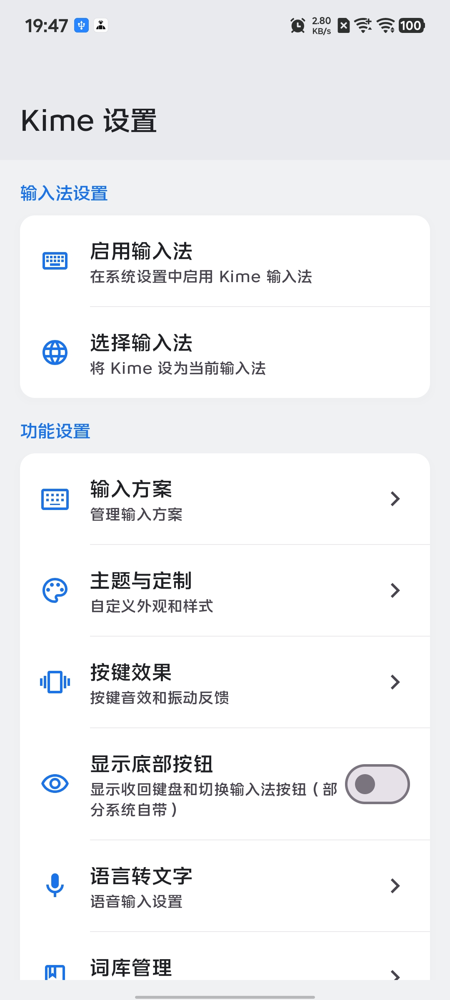
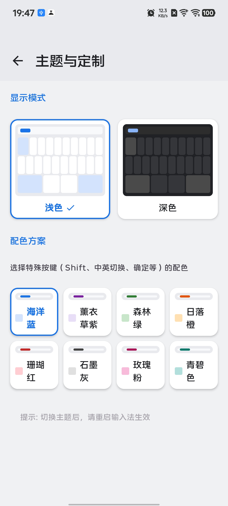
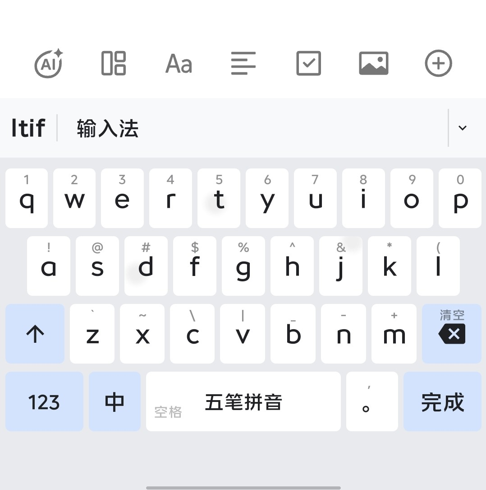

<p align="center">
  
</p>

<h1 align="center">Kime - 安卓五笔输入法</h1>

<p align="center">
  一款基于 <a href="https://rime.im/">Rime</a> 引擎构建的 Android 五笔输入法，专注于简洁高效的中文输入体验。
</p>

<p align="center">
  
  
  
  
  
</p>

> 这是专门为我的个人使用习惯而开发的五笔输入法，请勿用于商业用途。

## 功能特点

- **五笔86输入方案** - 支持五笔86及五笔拼音混输方案
- **Rime 引擎** - 使用成熟稳定的 Rime 输入法引擎
- **简洁界面** - Material Design 3 风格，支持浅色/深色主题
- **主题定制** - 多种键盘配色方案可选
- **按键反馈** - 可调节音效和振动强度
- **剪贴板管理** - 剪贴板历史记录，支持快捷发送
- **词库管理** - 查看和管理当前输入方案词库
- **候选词编码提示** - 候选词显示五笔编码，方便学习

## 系统要求

- Android 9.0 (API 28) 及以上

## 安装

### 从 Release 下载

1. 在 [Releases](https://github.com/ximeiorg/Kime/releases) 页面下载最新版本的 APK
2. 安装应用
3. 在系统设置中启用 Kime 输入法
4. 将 Kime 设为当前输入法

### 手动构建安装

1. 克隆项目并构建 APK
2. 安装应用
3. 在系统设置中启用 Kime 输入法
4. 将 Kime 设为当前输入法

## 使用文档

详细使用说明请查看 [使用文档](docs/使用文档.md)。

## 构建

```bash
# 克隆项目（包含子模块）
git clone --recursive https://github.com/ximeiorg/Kime.git

# 或者在已克隆的项目中初始化子模块
git submodule update --init --recursive

# 构建 Release APK
./gradlew assembleRelease
```


## 技术栈

- Kotlin
- Jetpack Compose
- Material Design 3
- Rime (librime)
- JNI (Native C++)

## 致谢

- [Rime](https://rime.im/) - 中州韵输入法引擎
- [Trime](https://github.com/osfans/trime) - 同文输入法，部分实现参考

## 许可证

MIT License